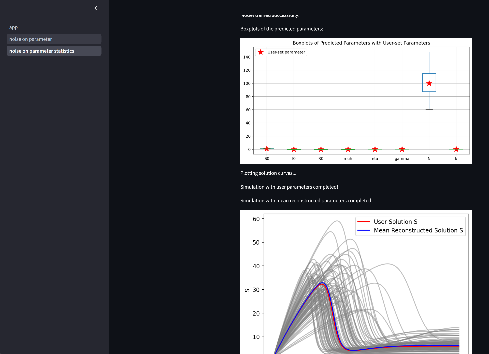

# SIR Model Simulation
## Overview
This project simulates the spread of an infectious disease using the Susceptible-Infected-Recovered (SIR) model. It features a deterministic or stochastic backend for efficient computation and a Streamlit frontend for interactive visualization of disease spread and control strategies.

## Features
- SIR Model Simulation: Models the dynamics of disease spread among a population, with compartments for Susceptible, Infected, and Recovered individuals.
- Stochastic or Deterministic Backend: Utilizes either stochastic or deterministic programming to simulate the spread of the disease.
  
- Streamlit Frontend: Provides an interactive and user-friendly interface for visualizing the simulation results, including plots of disease prevalence over time and the impact of different control strategies.
- SIR Model with Noise: Simulates an SIR model with noise on multiple SIR parameters and displays the results. XGBoost is used to train from randomized parameters (labels) and corresponding SIR curves (features). The trained XGBoost model predicts parameters for each sample based on infection curves with added Gaussian noise. A variational autoencoder (VAE) embeds samples into a 2-dimensional latent space, and these embeddings are used for final XGBoost training to map measured SIR simulations to parameters. Results are statistically presented, comparing mean estimated parameters to true parameter infection curves.
